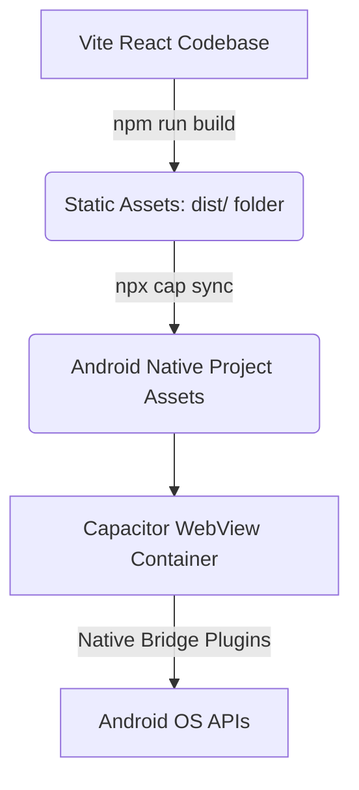

# Android App Conversion Documentation: Heartify

This documentation explains the architecture of the Android conversion, what has been accomplished so far, and the steps remaining to build and distribute the installation package (`.apk`).

---

## 1. How It Works (The Architecture)

This application is built as a **Hybrid Mobile App** using **Capacitor** (by Ionic).



* **Frontend Framework:** The application is written in React, TypeScript, TailwindCSS, and built with Vite. It functions as a single-page application (SPA).
* **Capacitor Container:** Capacitor acts as a native wrapper. It initializes a native Android project that contains an embedded web view component (`WebView`).
* **Static Asset Loading:** When the app opens on a phone, it loads the compiled web assets (`dist/` directory files) locally from the device's storage rather than requesting them from a remote server. This enables offline access and native-level speed.
* **Native Bridge:** Any native capabilities (like push notifications, splash screens, or deep links) use Capacitor plugins which map JavaScript calls directly to Java/Kotlin code in the Android runtime.

---

## 2. What Has Been Done

We have completed the entire setup up to the point of compiling the binary:

1. **Standalone App Configuration:**
   * Updated the configuration in [capacitor.config.ts](file:///c:/Users/arkfa/OneDrive/Documents/minhaz/pure-heartify/capacitor.config.ts).
   * Customized the App ID (package name) to `com.pureheartify.app`.
   * Commented out the cloud-preview URL (`server.url`) so the application builds from local code files instead of downloading the live-preview.

2. **Web Bundle Build:**
   * Ran package installation (`npm install`) to resolve all Node modules.
   * Executed the production build (`npm run build`) to produce the optimized production assets inside the `dist/` directory.

3. **Android Platform Generation:**
   * Created the native Android workspace under `/android` using `npx cap add android`.
   * Synced all static files and plugins using `npx cap sync android`.

4. **Gradle JDK Workaround:**
   * Configured the build environment to use **OpenJDK 21** (located under `C:\Users\arkfa\AppData\Local\JDownloader 2\jre`) to bypass Java 26 compatibility limitations with Gradle.

---

## 3. What is Left to Do (Next Steps)

To obtain the final `.apk` file for installation, you must install the Android SDK and compile the project.

### Step 1: Install the Android SDK
The build process needs the Android SDK toolchain. The easiest way to get this is to download and install [Android Studio](https://developer.android.com/studio).

### Step 2: Open and Build the App
Once Android Studio is installed:

#### Method A (Visual - Recommended)
1. Launch **Android Studio**.
2. Select **Open** and choose the `android` directory in your project:
   `c:\Users\arkfa\OneDrive\Documents\minhaz\pure-heartify\android`
3. Wait for Android Studio to index the project and download any required Gradle/Android SDK dependencies (indicated in the bottom status bar).
4. Click **Build** in the top menu bar, then click **Build Bundle(s) / APK(s)** -> **Build APK(s)**.
5. Once built, a popup will appear at the bottom right. Click **Locate** to find the file `app-debug.apk`.

#### Method B (Command Line)
If you prefer running commands, execute the following from the root directory of the project in PowerShell:
```powershell
# Set the Java Home path to the compatible JDK 21
$env:JAVA_HOME="C:\Users\arkfa\AppData\Local\JDownloader 2\jre"

# Navigate into android directory and build
cd android
.\gradlew assembleDebug
```
The output file will be generated at:
`android/app/build/outputs/apk/debug/app-debug.apk`

---

## 4. Installing the APK on a Mobile Device

Once you have the `app-debug.apk` file:
1. Transfer the `.apk` file to your Android phone (via USB, email, Google Drive, or Bluetooth).
2. On your phone, open a File Manager application and tap the `.apk` file.
3. If prompted, enable **"Install from Unknown Sources"** for your file manager.
4. Follow the prompts to install the app. It will appear on your home screen or app drawer under the name **heartify**.
